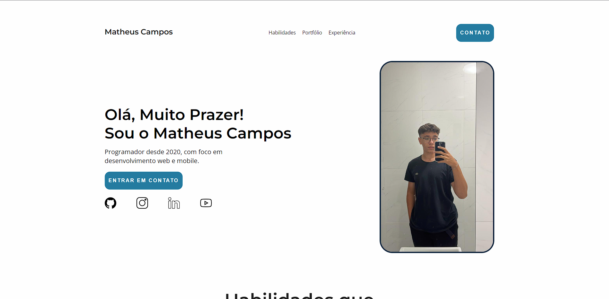

Introduction

This is a project to start the studies about HTML, CSS and JS.
The main goal is create a website with my main professional information.

# Preview



## Live link:

https://matheuscamp.github.io/Portifolio/

## Main concepts applied

- Flexbox
- DOM manipulation
- Events
- CSS Media Query

## Instructions to run:

1. Clone the project:

```
git clone https://github.com/Matheuscamp/Portifolio.git
```

2. After clone open the folder:

```
site-portfolio
```

3. Open the index file with browser:

```
index.html
```
